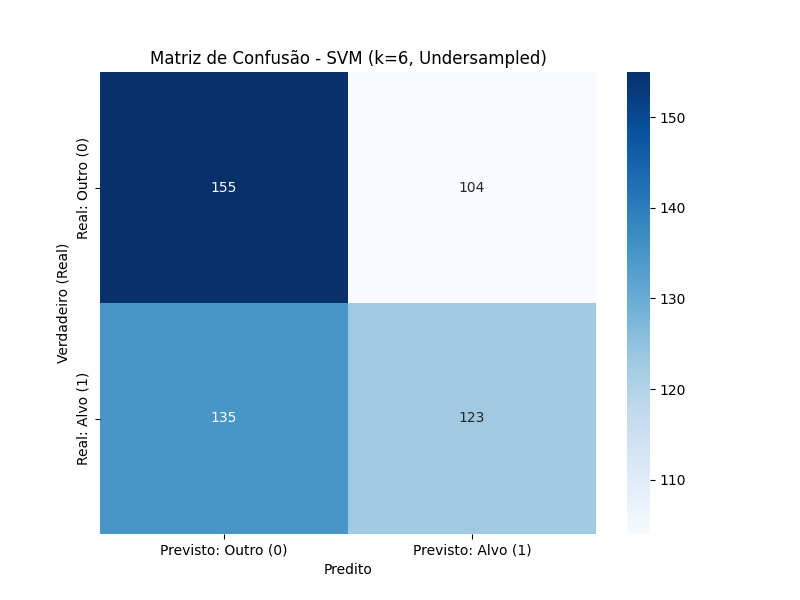
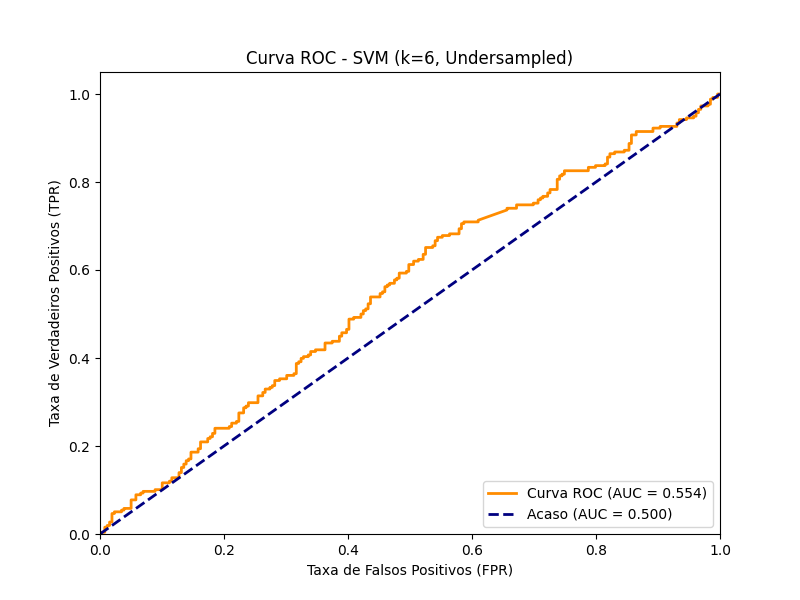

# Integração de Imputação de Dados Faltantes e Categorização de Sequências de DNA

**Proposta de um algoritmo computacional**

**Caio Grilo da Cunha**

Orientador: Prof. Gabriel Evaristo Santana da Silva

Ciência da Computação, UNIFEOB (São João da Boa Vista, SP), edital de pesquisa 02/2025

---

## Resumo

A presença de dados faltantes (`'N'`) em genomas compromete análises
computacionais. Este trabalho desenvolveu um pipeline para imputar dados e
classificar a função de genes.

- **Imputação:** a metodologia de imputação híbrida (**Clusterização K-Means + KNN Ponderado**) atingiu **62,73 % de acurácia**, superando o baseline global (**26,60 %**). Ela foi aplicada em um dataset de **14,4 milhões de linhas** via processamento em lotes.
- **Classificação:** comparou-se SVM contra modelos de Deep Learning. Todos convergiram para **~60 % de acurácia**, com o **SVM (59,72 %)** superando redes neurais penalizadas por truncamento de sequência.
- **Conclusão:** a solução é escalável, mas o desempenho final é limitado pela qualidade dos dados brutos (*Garbage In, Garbage Out*) e pela escassez de anotações funcionais.

**Palavras-chave:** bioinformática; imputação híbrida; aprendizado de máquina; SVM; redes neurais; sequências genômicas.

As seções seguintes detalham a metodologia e os resultados, com base no relatório de pesquisa do projeto.

## Motivação

Dados de sequenciamento de nova geração (NGS) raramente são perfeitos. Baixa cobertura de leitura e ambiguidades biológicas geram posições desconhecidas, representadas pelo código IUPAC `N`. Bases ambíguas degradam alinhadores como o BLAST e distorcem análises filogenéticas. É o fenômeno *Garbage In, Garbage Out* (GIGO).

Há métodos de imputação consolidados para dados **numéricos** (SVDimpute e EM para microarrays). Sequências ATGC, porém, são **dados categóricos** e exigem uma abordagem adaptada. O KNN é robusto para dados genômicos ruidosos (Troyanskaya et al., 2001; Kim et al., 2005), mas depende de uma boa definição de "vizinho". Em datasets grandes e heterogêneos, a busca **global** compara genes sem relação entre si.

Este trabalho combina três ideias da literatura:

- **Clusterização antes do KNN** (Dubey & Rasool, 2021; Brás & Menezes, 2007): vizinhos buscados apenas entre genes semelhantes.
- **Voto ponderado pela distância** (Schwender, 2008): vizinhos mais próximos pesam mais.
- **Classificação funcional sobre as sequências imputadas**, comparando abordagens *agnósticas à ordem* (k-mers + SVM) com abordagens *sensíveis à ordem* (CNN, LSTM).

## Dados

| Item | Valor |
|------|-------|
| Fonte | Ensembl BioMart, genoma humano **GRCh38.p14** |
| Sequências de genes (`genes_export.csv`) | ~80.000 (~77 mil sem `N`) |
| Anotações funcionais (`gene_funcao.txt`) | Gene Ontology |
| Homólogos (`gene_ortologos.txt`) | Ortólogos por gene |
| Dataset mestre após o merge | **14,4 milhões de linhas, ~20 GB** |
| Genes únicos com rótulo funcional | **5.014** |

Como cada gene tem várias anotações GO, o merge gera uma explosão combinatória: uma linha por par (gene, anotação).

## Metodologia

Implementado em Python 3.12 com pandas, scikit-learn (SVM, K-Means, CountVectorizer), imbalanced-learn (undersampling) e TensorFlow (MLP, CNN, CNN-LSTM).

```
 FASE 1  Coleta          Ensembl BioMart ─► genes_export · gene_funcao · gene_ortologos
                                                    │ merge por ID Ensembl
                                                    ▼
                                          dataset_mestre.csv (14,4 M linhas)
 FASE 2  Treino do       sequências sem 'N' ─► CountVectorizer (k-mers k=6, 4.110 features)
         imputador                          ─► K-Means (200 clusters) ─► .joblib
                                                    ▼
 FASE 3  Aplicação       lotes de 5.000 linhas + checkpoint (2.884 lotes, limite de 16 GB de RAM)
         do imputador    cluster previsto ─► 5 vizinhos (Hamming) ─► voto ponderado
                                                    ▼
 FASE 4  Classificação   achatamento (1 linha/gene) ─► undersampling 1:1 ─► SVM | MLP | CNN | CNN-LSTM
```

### Imputação: KNN híbrido

1. As sequências **sem `N`** formam a base de referência e são vetorizadas em **k-mers de tamanho 6** (4.110 features).
2. O **K-Means** agrupa essa referência em **200 clusters**, que funcionam como "famílias" de genes.
3. Para cada sequência com `N`, o modelo prevê o cluster e busca os **5 vizinhos mais próximos** (distância de Hamming) **apenas dentro dele**.
6. Cada base faltante recebe o **voto ponderado** dos vizinhos, com peso
   `1 / (distância + 1)`.

**Validação:** 5 % das posições de sequências limpas são mascaradas como `N`, e mede-se a fração de bases recuperadas corretamente. Com 4 bases possíveis, o acaso é de 25 %.

**Escala:** o vetorizador e o K-Means são treinados uma vez e salvos em disco. O dataset de 14,4 M linhas é então lido em lotes de 5.000 linhas, e cada lote imputado é anexado ao arquivo de saída. Um checkpoint permite retomar a execução se ela for interrompida.

### Classificação funcional

- **Tarefa:** classificação binária, `protein binding` contra outras funções.
- **Dataset:** 5.014 genes (3.723 contra 1.291), balanceados por **undersampling** para **1.291 contra 1.291 (2.582 amostras)**.
- **Modelos:**

| Modelo    | Entrada | Arquitetura |
|-----------|---------|-------------|
| SVM linear | Contagem de k-mers (k = 6), sequência inteira | `SVC(kernel='linear', C=1.0)` |
| MLP        | Contagem de k-mers (k = 6) normalizada | Dense(128) → Dense(64), Dropout 0,5 |
| CNN        | Tokens por base, **truncados em 2.000 bases** + Embedding (100 dim) | 2 blocos Conv1D (64 e 128 filtros) + GlobalMaxPooling |
| CNN-LSTM   | Tokens por base, **truncados em 2.000 bases** + Embedding (100 dim) | Conv1D (64) + LSTM bidirecional (100) |

As redes foram treinadas no Google Colab (GPU T4) com EarlyStopping. Todos os modelos usam a mesma divisão treino/teste (80/20, `random_state=42`).

## Resultados

### Imputação

**Tabela 1.** Acurácia na recuperação de 5 % de `N` simulados.

| Iteração | Metodologia | Parâmetros | Acurácia | Código |
|----------|-------------|------------|----------|--------|
| 1 (baseline) | KNN global, voto simples | — | 26,60 % | [v01](experimentos/v01_imputacao_knn_global) |
| 2 (híbrido) | Cluster (CountVectorizer) + KNN simples | k = 4, 50 clusters | 56,03 % | [v02](experimentos/v02_imputacao_kmeans_knn) |
| 3 (otimizado) | Cluster (CountVectorizer) + KNN simples | k = 6, 200 clusters | 58,39 % | [v02](experimentos/v02_imputacao_kmeans_knn) |
| 4.1 (teste TF-IDF) | Cluster (TF-IDF) + KNN simples | k = 6, 200 clusters | 57,92 % | [v03](experimentos/v03_imputacao_tfidf) |
| **4.2 (campeão)** | **Cluster (CountVectorizer) + KNN ponderado** | **k = 6, 200 clusters, kNN = 5** | **62,73 %** | [v04](experimentos/v04_imputacao_knn_ponderado) |

- **O baseline falhou.** Os 26,60 % são estatisticamente iguais ao acaso (25 %). A distância de Hamming global é inadequada para sequências longas, porque o sinal dos motivos conservados fica "afogado" no ruído de milhares de bases não conservadas.
- **A clusterização foi o maior salto do projeto.** A acurácia passou de 26,60 % para 56,03 % porque o modelo passou a comparar "sinal com sinal".
- **O voto ponderado completou a otimização**, chegando a 62,73 %. A escolha dos vizinhos depende de quem eles são e também de quão perto estão.
- O modelo campeão foi aplicado ao dataset mestre inteiro: **14,4 milhões de linhas em 2.884 lotes**, concluído com sucesso.

### Classificação

**Tabela 2.** Desempenho no dataset balanceado (2.582 amostras).

| Modelo | Entrada | Acurácia | Recall (classe 0 / classe 1) | Código |
|--------|---------|----------|------------------------------|--------|
| **SVM (campeão)** | **CountVectorizer (k = 6)** | **59,72 %** | **0,64 / 0,56** | [v09](experimentos/v09_svm_graficos) |
| CNN-LSTM | Embedding (truncado em 2k) | 59,57 % | 0,53 / 0,66 | [notebook](experimentos/v10_deep_learning/CNN-LSTM.ipynb) |
| CNN | Embedding (truncado em 2k) | 59,19 % | 0,58 / 0,60 | [notebook](experimentos/v10_deep_learning/CNN-versao03.ipynb) |
| MLP | CountVectorizer (k = 6) | 58,99 % | 0,53 / 0,66 | [notebook](experimentos/v10_deep_learning/CNN-versao03.ipynb) (última célula) |

Os resultados da CNN e da CNN-LSTM estão nas saídas salvas dos notebooks. A célula do MLP não tem saída salva, então esse valor vem do relatório de pesquisa. A evolução das redes, incluindo o protótipo com overfitting, está em [`experimentos/README.md`](experimentos/README.md#parte-3-deep-learning-v10).

- Todos os modelos convergiram para um **teto de ~60 %**, cerca de 10 pontos acima do acaso (50 %). Isso indica que há sinal biológico nos dados imputados.
- O SVM teve a maior acurácia, os recalls mais equilibrados entre as classes e **AUC de 0,595**.

<p float="left">
  
  
</p>

> Matriz de confusão e curva ROC do SVM, geradas pelo script
> [v09](experimentos/v09_svm_graficos) (as mesmas figuras do relatório de
> pesquisa). Nesta execução específica, a acurácia foi de 53,8 % e a AUC de
> 0,554.

## Discussão

**1. O teto de ~60 % reflete os dados, não os modelos.** Arquiteturas muito diferentes chegaram ao mesmo patamar, e há dois gargalos:

- **GIGO (*Garbage In, Garbage Out*):** os erros da imputação se propagam para a etapa de classificação.
- **Fome de dados:** só 5.014 dos ~80 mil genes tinham rótulo funcional. Um treino com 1.291 exemplos por classe é pequeno demais para modelos complexos (CNN, MLP) num espaço de 4.110 dimensões. Os modelos não sofreram overfitting: simplesmente não tinham exemplos suficientes para aprender padrões complexos.

**2. O SVM venceu pelo pré-processamento, não pela arquitetura.** O CountVectorizer usa a **sequência inteira**, mesmo com dezenas de milhares de bases, para montar a "sopa de k-mers". As redes neurais receberam só as **primeiras 2.000 bases**, então o restante das sequências longas foi descartado antes do treino. Em cenários de pouco dado e muito ruído, modelos clássicos com uma boa representação podem ser mais eficazes que Deep Learning.

## Conclusões

- A imputação de dados genômicos categóricos **não pode usar similaridade global**: o KNN global teve 26,60 %, igual ao acaso.
- A **metodologia híbrida** (pré-clusterização por k-mers + busca local + voto ponderado) é robusta e chegou a **62,73 %**, com escalabilidade demonstrada em 14,4 milhões de linhas.
- Há **sinal biológico válido** nos dados imputados: todos os classificadores superaram o acaso, e o **SVM venceu com 59,72 %**.
- O teto de ~60 % não é uma falha do classificador. Ele mede diretamente a qualidade e a quantidade dos dados que o alimentaram.

## Trabalhos futuros

Planejados no cronograma do projeto:

- **Achatar antes de imputar:** consolidar os 14,4 M de linhas nos ~80 mil genes únicos, mantendo inclusive os genes sem rótulo, e aplicar a imputação nesse dataset menor.
- **Retreinar os classificadores** (SVM, MLP, CNN) no dataset completo e obter métricas definitivas: acurácia, AUC e F1-score.
- **Explorar os dados de ortólogos** coletados na Fase 1.
- **Comparar** o protótipo de 5 mil genes com o dataset final de 80 mil.

Melhorias metodológicas identificadas:

- **Deep Learning sem truncamento**, com janelas deslizantes ou embeddings de k-mers.
- **Protocolo de avaliação:** balancear apenas o conjunto de treino (como no experimento com SMOTE, [v07](experimentos/v07_svm_smote)), usar validação cruzada e separar um conjunto de validação próprio para o EarlyStopping das redes. Hoje ele monitora o conjunto de teste.
- **Distância para sequências de tamanhos diferentes:** alinhamento ou distâncias baseadas em k-mers no lugar da penalidade heurística de Hamming.

## Como executar

```bash
python -m venv .venv
.venv\Scripts\activate          # Windows  (Linux/macOS: source .venv/bin/activate)
pip install -r requirements.txt

python pipeline.py tudo         # ou uma etapa: juntar | imputar | achatar | treinar | analise
python -m pytest                # testes
```

| Etapa     | Módulo                              | O que faz |
|-----------|-------------------------------------|-----------|
| `juntar`  | `src/dnacategory/dataset.py`        | Fase 1: normaliza os IDs Ensembl e junta sequências, GO terms e ortólogos. |
| `imputar` | `src/dnacategory/imputacao.py`      | Fases 2 e 3: treina o imputador (se ainda não existir) e preenche os `N` em lotes, com checkpoint. |
| `achatar` | `src/dnacategory/dataset.py`        | Fase 4: agrupa por gene; `label = 1` se qualquer anotação do gene for `protein binding`. |
| `treinar` | `src/dnacategory/classificacao.py`  | Fase 4: undersampling 1:1, k-mers, SVM linear, métricas, matriz de confusão e curva ROC. |
| `analise` | `src/dnacategory/analise.py`        | Relatório exploratório: comprimento, bases `N` e conteúdo GC. |

Caminhos e hiperparâmetros ficam centralizados em [`config.py`](config.py).
Os dados (~20 GB) não estão versionados. Exporte-os do Ensembl BioMart e
coloque-os em `data/`:

| Arquivo              | Conteúdo esperado |
|----------------------|-------------------|
| `genes_export.csv`   | 1ª coluna com o ID do gene e coluna `Sequencia` |
| `gene_funcao.txt`    | CSV com `Gene stable ID`, `GO term name`, `GO domain` |
| `gene_ortologos.txt` | CSV com `Gene stable ID` + colunas de ortólogos |

O imputador campeão já treinado está em `models/` (4.110 k-mers, 200 clusters). Com ele, a etapa `imputar` não precisa retreinar o K-Means. Para forçar o retreino, use `--retreinar-imputador`.

O pipeline (`pipeline.py`) cobre a imputação e o SVM. Os modelos de Deep Learning estão nos notebooks de [`experimentos/v10_deep_learning`](experimentos/v10_deep_learning), feitos
para o Google Colab.

## Estrutura do repositório

```
├── config.py            # caminhos e hiperparâmetros
├── pipeline.py          # CLI: python pipeline.py <etapa>
├── src/dnacategory/     # código do pipeline
├── tests/               # testes unitários e de ponta a ponta com dados sintéticos
├── experimentos/        # código de cada iteração (v01 a v10), ver experimentos/README.md
├── models/              # imputador campeão (CountVectorizer + K-Means)
├── reports/figures/     # gráficos de avaliação
└── data/                # dados de entrada e intermediários (não versionado)
```

## Referências

- BRÁS, L. P.; MENEZES, J. C. Improving cluster-based missing value estimation of DNA microarray data. *Biomolecular Engineering*, v. 24, n. 2, p. 273–282, 2007.
- DUBEY, A.; RASOOL, A. Efficient technique of microarray missing data imputation using clustering and weighted nearest neighbour. *Scientific Reports*, v. 11, n. 24297, 2021.
- HAMMING, R. W. Error detecting and error correcting codes. *Bell System Technical Journal*, v. 29, n. 2, p. 147–160, 1950.
- KEERIN, P. et al. Improved KNN Imputation for Missing Values in Gene Expression Data. *Computers, Materials & Continua*, v. 70, n. 2, p. 2691–2710, 2021.
- KIM, H.; GOLUB, G. H.; PARK, H. Missing value estimation for DNA microarray gene expression data: local least squares imputation. *Bioinformatics*, v. 21, n. 2, p. 187–198, 2005.
- LI, Y. et al. Deep learning in bioinformatics: introduction, application, and perspective in the big data era. *Methods*, v. 166, p. 4–21, 2019.
- SCHWENDER, H. *Imputing missing genotypes with weighted k nearest neighbors*. Dortmund: SFB 475, Technische Universität Dortmund, 2008. (Technical Report).
- TROYANSKAYA, O. et al. Missing value estimation methods for DNA microarrays. *Bioinformatics*, v. 17, n. 6, p. 520–525, 2001.
- WIENS, J. J.; MOEN, D. S. Missing data and the accuracy of phylogenetics. *Journal of Systematics and Evolution*, v. 46, n. 3, p. 307–314, 2008.

A lista completa de referências está no relatório de pesquisa e no resumo expandido.

## Agradecimentos

Ao orientador, Prof. Gabriel Evaristo Santana da Silva, pela orientação, apoio e incentivo durante todas as etapas deste trabalho.
